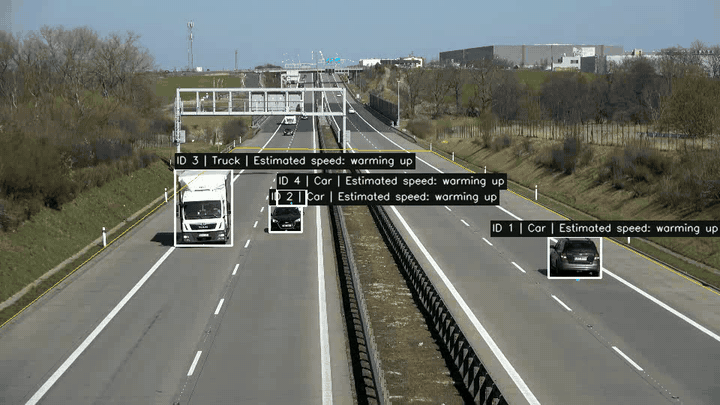

# RoadTrace

### Vehicle trajectories and speed from traffic video

RoadTrace follows vehicles through a fixed-camera road video and turns their movement into trajectories, estimated speeds in **mph**, and a CSV that can be inspected frame by frame. It's a small Python project for exploring what traffic video can tell us about vehicle movement, and where those measurements become unreliable.

## See the run

The eight-second clip below is an actual output from the project. It shows tracked vehicle IDs, their recent paths, and speed estimates in both directions of travel. You can watch it before setting anything up.

[](https://github.com/GauravKudeshia/RoadTrace/raw/refs/heads/main/demo/traffic-demo.mp4)

**[Download the full demo (MP4)](https://github.com/GauravKudeshia/RoadTrace/raw/refs/heads/main/demo/traffic-demo.mp4)** · [View the measurements](demo/vehicle_data.csv) · [View the speed distribution](demo/speed_distribution.png)

The yellow outline marks the road area used for calibration. A vehicle needs about one second of usable tracking history before a speed appears. “Warming up,” “partial view,” and “beyond calibration” explain why some vehicles don't have a number yet.

This run produced 14 track IDs and 803 frame-level observations. Six tracks had enough usable data for speed estimates. The mean of their individual median speeds was **70.5 mph**; the median was **74.0 mph**. These are outputs from approximate road geometry, not speeds checked against a radar or another reference. The [demo notes](demo/README.md) explain how to read them.

## What the project does

A pretrained YOLO11n model detects cars, trucks, buses, and motorcycles. ByteTrack links detections across frames. The bottom-center of each box is used as the vehicle's road position, and a perspective transform maps that point into meters on an approximately flat road.

Speed comes from distance traveled over elapsed video time. The sample uses a one-second window and median smoothing to reduce frame-to-frame noise. The video stays in its original view; the coordinate transform is used for measurement.

Each run saves an annotated video, a trajectory CSV, and a speed histogram. Counts and speed statistics are printed in the terminal. The histogram uses one median speed per track, so a vehicle that stays on screen longer doesn't dominate the result.

The detection and tracking methods come from existing libraries. The work here is connecting them to road calibration, handling missing or unreliable speed measurements, and making the results inspectable.

## RoadTrace Analytics — mobile and dashboard extensions

The newer application adds a mobile-browser traffic-observation interface, a multi-video dashboard, public road-safety data adapters and a packaged Python pipeline. **The original project and the saved demonstration in this repository are preserved.**

**[Live browser app](https://roadtrace-analytics.netlify.app/)** · [Streamlit dashboard](https://roadtrace-analytics-d.streamlit.app/) · [Project guide](docs/PROJECT_GUIDE.md) · [Browser setup](web/README.md) · [Validation](docs/VALIDATION.md)

| Workflow | Location | How to run |
| --- | --- | --- |
| Original video pipeline | Root folder | `python run_sample.py` |
| Packaged pipeline | `core/` | `python -m core.app --video your_video.mp4` |
| Streamlit dashboard | `dashboard/` | Install `requirements-analytics.txt`, then `streamlit run dashboard/app.py` |
| Browser-based detection and speed estimates | `web/` | Follow `web/README.md` for ONNX export, then serve locally |
| Public data context | `data_layers/` | Used by the dashboard when location information is available |

**Documented sample:** 24 core tests reported passing; 200 frames, 14 tracked software IDs, 803 trajectory observations and 461 numeric speed observations in an eight-second source clip. These are **software outputs, not verified roadside speed or count accuracy**.

The browser uses on-device inference with automatic approximate scale cues; the calibrated Python workflow is separate. The browser may contact external APIs for weather and road context, and the hosted Streamlit dashboard runs server-side. Field accuracy remains to be independently verified.

The new material was adapted from [RoadTrace-Analytics](https://github.com/anurodhsingh3862/RoadTrace-Analytics). [Source attribution and licensing notice](ATTRIBUTION.md) applies; importing the code does not resolve its open licensing question.

## Run it locally

Use Python 3.10 or newer. Clone or download this repository, open a terminal in its folder, then run:

```bash
python -m venv .venv
source .venv/bin/activate
python -m pip install -r requirements.txt
python run_sample.py
```

On Windows PowerShell, replace the activation line with `.venv\Scripts\Activate.ps1`.

The sample video and its calibration are included. The first run downloads the pretrained model weights if they're missing; no training is needed. New results are saved in `output-perspective-mph/`. The files in `demo/` are a saved run for readers and won't be overwritten.

For offline use, pass downloaded weights with `python run_sample.py --model /path/to/yolo11n.pt`.

## Try another video

```bash
python app.py --video input/your_video.mp4
```

This gives you detections, tracks, and counts. To estimate speed, supply measurements from that camera view. The sample's calibration won't transfer to a different road or camera angle.

The [usage guide](docs/usage.md) covers perspective calibration, the simpler two-point option, CLI arguments, and CSV columns. The [sample calibration notes](SAMPLE_CALIBRATION.md) show the exact road points and dimensions used in the demo.

## What still needs checking

The biggest open question is physical speed accuracy. The road dimensions are approximate, and the transform assumes a flat surface. Box position, occlusion, lens distortion, camera movement, and frame timing can all change the estimate. Distant vehicles are especially sensitive to small pixel errors.

Track IDs can also split or switch. The reported vehicle count is a count of IDs, and the vehicles-per-minute figure is a rate over the short clip, not a count at a road cross-section. Eight seconds of footage is enough to inspect the pipeline, but it isn't a traffic survey.

There are **24 automated tests** covering known motion, perspective geometry, mph conversion, missing detections, clipped boxes, aggregation, and video/CSV output. Run them with:

```bash
python -m unittest -v test_pipeline.py
```

The [validation record](VALIDATION.md) contains the tested environment and results. A useful next experiment would compare these trajectories with manually checked tracks and independently measured speeds, then examine error by distance from the camera. Lane-level flow and headway measurements would need additional work.

## Find your way through the code

| File | Role |
| --- | --- |
| `app.py` | Video processing, command-line options, and annotations |
| `detector.py` | YOLO detections and vehicle classes |
| `tracker.py` | ByteTrack IDs and recent trajectory points |
| `speed_estimator.py` | Road calibration, motion history, and mph estimates |
| `analytics.py` | CSV export and per-track statistics |
| `run_sample.py` | Reproduce the included sample |
| `sample_perspective.json` | Geometry for this camera view |
| `test_pipeline.py` | Automated checks |

## Sources

The footage is an excerpt of [Roboflow's traffic video](https://media.roboflow.com/supervision/video-examples/vehicles.mp4). The road geometry comes from Piotr Skalski's [speed estimation tutorial](https://blog.roboflow.com/estimate-speed-computer-vision/) and its published example. The clip is resized to 960 × 540 and retains the original 25 FPS. The source footage was not collected for this project.

Detection uses [Ultralytics YOLO](https://docs.ultralytics.com/modes/track/), with the built-in [ByteTrack](https://arxiv.org/abs/2110.06864) tracker. See [SAMPLE_CALIBRATION.md](SAMPLE_CALIBRATION.md) for source coordinates and assumptions.
